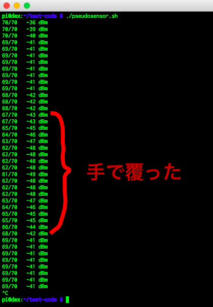

# Raspberry Pi 3 Some Tools

If you set to force_turbo=1 in /boot/config.txt, these scripts are useless.

## Table of Contents

- [Pseudo Motion Sensor](#Pseudo Motion Sensor)
- [Updating Script](#update-raspi.sh)
- [CPU Configuration](#cpu-config.sh)
- [Raspberry Pi Monitor](#raspi-stat.sh)
- [Converting Animation Gif](#movie2gif.sh)


<a name="Pseudo Motion Sensor"></a>
## Pseudo Motion Sensor

貧乏なので人感センサーを買えません。そこで考えたのが Wi-Fi の RSSI です。下図のように手で覆っただけで変化があります。下図は 1 sec 間隔ですが 0.1 sec 間隔にするともっと精度が上がります。ラズパイと AP の間を歩くだけでも RSSI の減衰を確認できるので結構使えると個人的には思います。



個人個人それぞれの判定アルゴリズムを組み込めば、"ギリギリ" 人感センサーができます。異論は認めます。

今回はサンプルとして、ある領域に侵入したら LED が光るようにしました(下図)。


<a name="update-raspi.sh"></a>
## update-raspi.sh

upgrade packages and check firmware version and update firmware.

Usage:

```
./update-raspi.sh
Checking packages...
取得:1 http://mirrordirector.raspbian.org jessie InRelease [14.9 kB]

...snip...

無視 http://mirrordirector.raspbian.org jessie/rpi Translation-en
9,105 kB を 52秒 で取得しました (173 kB/s)
パッケージリストを読み込んでいます... 完了

パッケージリストを読み込んでいます... 完了
依存関係ツリーを作成しています
状態情報を読み取っています... 完了
アップグレードパッケージを検出しています ... 完了
アップグレード: 0 個、新規インストール: 0 個、削除: 0 個、保留: 0 個。

パッケージリストを読み込んでいます... 完了
依存関係ツリーを作成しています
状態情報を読み取っています... 完了
アップグレード: 0 個、新規インストール: 0 個、削除: 0 個、保留: 0 個。

パッケージリストを読み込んでいます... 完了
依存関係ツリーを作成しています
状態情報を読み取っています... 完了

Checking firmware...
Current: 4.4.20
New: 4.4.21
New firmware found.
Do you update firmware? [Y/n]
y
Backup icurrent firmware revision.
Start rpi-update.
 *** Raspberry Pi firmware updater by Hexxeh, enhanced by AndrewS and Dom
 *** Performing self-update
 *** Relaunching after update
 *** Raspberry Pi firmware updater by Hexxeh, enhanced by AndrewS and Dom
This update bumps to rpi-4.4.y linux tree
Be aware there could be compatibility issues with some drivers
Discussion here:
https://www.raspberrypi.org/forums/viewtopic.php?f=29&t=144087
##############################################################
 *** Downloading specific firmware revision (this will take a few minutes)
  % Total    % Received % Xferd  Average Speed   Time    Time     Time  Current
                                 Dload  Upload   Total   Spent    Left  Speed
100   168    0   168    0     0    168      0 --:--:-- --:--:-- --:--:--   168
100 51.4M  100 51.4M    0     0   570k      0  0:01:32  0:01:32 --:--:-- 1061k
 *** Updating firmware
 *** Updating kernel modules
 *** depmod 4.4.21+
 *** depmod 4.4.21-v7+
 *** Updating VideoCore libraries
 *** Using HardFP libraries
 *** Updating SDK
 *** Running ldconfig
 *** Storing current firmware revision
 *** Deleting downloaded files
 *** Syncing changes to disk
 *** If no errors appeared, your firmware was successfully updated to f3ea581387825d5693bff075f800c00fe825c106
 *** A reboot is needed to activate the new firmware

Finish update.
```


<a name="cpu-config.sh"></a>
## cpu-config.sh

This script sets some CPU values.

Usage:

```
./cpu-config.sh option
```

option:

 - performance; Set to governor performance.
 - myondemand; Set to governor ondemand and up_threshold to 95, sampling_down_factor to 85.
 - powersave; Set to governor powersave.
 - ondemand; Set to governor ondemand and up_threshold to 50, sampling_down_factor to 50. This is default for Raspbian jessie.

For example you can set crontab -e or /etc/crontab like that.

```
@reboot    /home/pi/script/path/cpu-config.sh myondemand
```

Example 2;

```
./cpu-config.sh performance
```

I recommend myondemand. And I do not recommend ondemand. Because up_threshold is 50 when ondemand. And cpu freq increases soon very much. Even if device is idling. So temperature also increases. Or if you change governor ondemand > performance > ondemand, up_threshold is 95. But sampling_down_factor is 50. So OS keeps overclock for a while. As the result of it, temperature become hot.


<a name="raspi-stat.sh"></a>
## raspi-stat.sh

This script show status of Raspberry Pi 3. Statuses are OS name, version, CPU info, memory info, voltage. CPU info contains arm and core clock, temperature, governor, up threshold if governor is ondemand like that.

### myondemand

```
idle
===== OS ======  ==================
Name             Raspbian GNU/Linux
Version          8 (jessie)
===== CPU =====  ==================
Clock arm        600000000Hz
Clock core       250000000Hz
CPU Temperature  51.5 C
GPU Temperature  51.5'C
Governor         ondemand
UP threshold     95
Down threshold   90
===== Mem =====  ==================
Mem arm          944M
Mem gpu          64M
==== Volt =====  ==================
core             volt=1.2000V
sdram_c          volt=1.2000V
sdram_i          volt=1.2000V
sdram_p          volt=1.2250V
===============  ==================

load
===== OS ======  ==================
Name             Raspbian GNU/Linux
Version          8 (jessie)
===== CPU =====  ==================
Clock arm        1200000000Hz
Clock core       250000000Hz
CPU Temperature  55.8 C
GPU Temperature  56.9'C
Governor         ondemand
UP threshold     95
Down threshold   90
===== Mem =====  ==================
Mem arm          944M
Mem gpu          64M
==== Volt =====  ==================
core             volt=1.2000V
sdram_c          volt=1.2000V
sdram_i          volt=1.2000V
sdram_p          volt=1.2250V
===============  ==================
```

### performance

```
idle
===== OS ======  ==================
Name             Raspbian GNU/Linux
Version          8 (jessie)
===== CPU =====  ==================
Clock arm        1200000000Hz
Clock core       400000000Hz
CPU Temperature  53.6 C
GPU Temperature  53.7'C
Governor         performance
===== Mem =====  ==================
Mem arm          944M
Mem gpu          64M
==== Volt =====  ==================
core             volt=1.2000V
sdram_c          volt=1.2000V
sdram_i          volt=1.2000V
sdram_p          volt=1.2250V
===============  ==================

load
===== OS ======  ==================
Name             Raspbian GNU/Linux
Version          8 (jessie)
===== CPU =====  ==================
Clock arm        1200000000Hz
Clock core       250000000Hz
CPU Temperature  55.8 C
GPU Temperature  56.3'C
Governor         performance
===== Mem =====  ==================
Mem arm          944M
Mem gpu          64M
==== Volt =====  ==================
core             volt=1.2000V
sdram_c          volt=1.2000V
sdram_i          volt=1.2000V
sdram_p          volt=1.2250V
===============  ==================
```


<a name="movie2git.sh"></a>
## movie2gif.sh

This is front-end script which converts movie file to optimized animation gif.

Usage:

```
movie2gif.sh file
```


## License

MIT


## Author

tkumata
